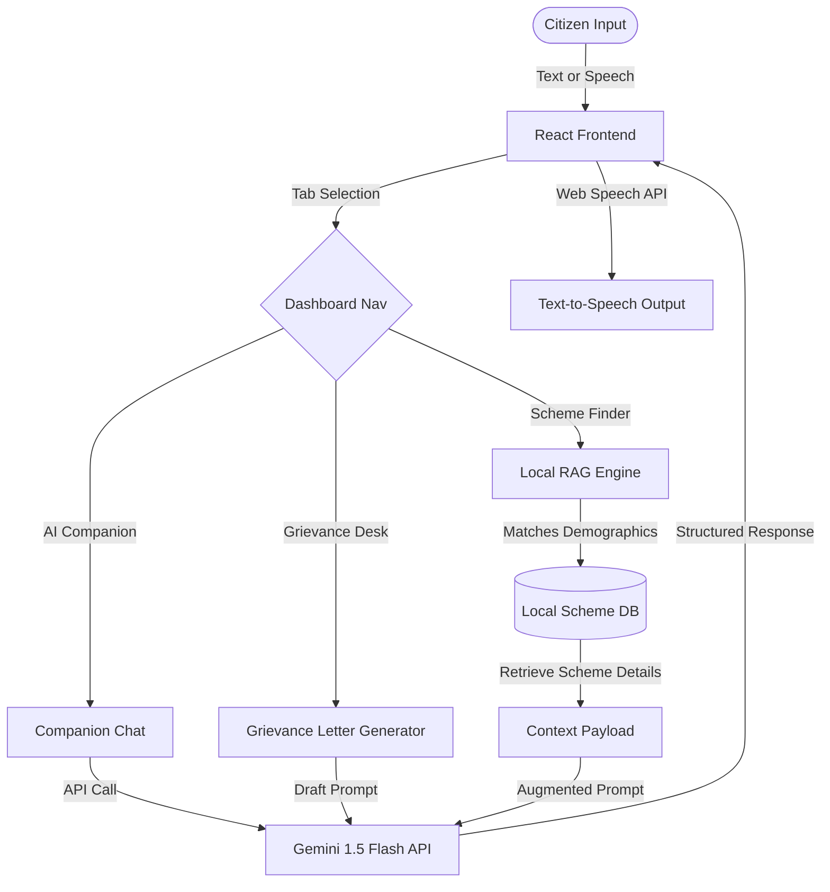

# 🇮🇳 BharatSathi AI - Smart Bharat Civic Companion

> **Submission for DEVENGERS PromptWars 2026**
>
> A GenAI-powered, accessibility-first civic platform designed to democratize government services, simplify welfare schemes, and streamline public grievance reporting for every Indian citizen.

---

## 🚀 Live App & Code Links
- **Deployed Project Link:** [https://bharatsathi-ai.vercel.app](https://bharatsathi-ai.vercel.app) *(Deploy this repo to Vercel/Netlify with your Gemini API key)*
- **GitHub Repository Link:** [Public Repository Link]
- **YouTube Pitch/Demo:** [Link to Demo Video]

---

## 📋 Problem Statement & Impact
Indian citizens often struggle to navigate complex bureaucratic processes, find relevant government schemes, and draft formal complaints due to:
1. **Information Overload:** Public information is scattered across dozens of disjointed ministry portals.
2. **Language Barriers:** Most portals default to English or official Hindi, excluding rural populations.
3. **Complex Documentation:** Vague requirements lead to multiple wasted visits to citizen service centers.
4. **Lack of Guidance:** Difficulty drafting formal grievance letters for municipal problems.

**BharatSathi AI** solves these hurdles by acting as an intelligent, multilingual, voice-enabled civic navigator.

---

## ✨ Key Features

### 1. 🤖 BharatSathi Chatbot (Civic Companion)
- **Generative Q&A:** Simplifies legal terms, explains how to apply for cards (Aadhaar, Passport, PAN), and guides users.
- **Multilingual Support:** Instant language toggling for **English, Hindi (हिंदी), Marathi (मराठी), Tamil (தமிழ்), and Bengali (বাংলা)**.
- **Voice Assistant:** Integrates browser-based **Speech-to-Text** (mic input) and **Text-to-Speech** (reads answers aloud) for accessibility.

### 2. 🌾 Scheme Recommendation Engine (Local RAG)
- Matches citizens to active central schemes (like PM-KISAN, PM-Mudra, Ayushman Bharat, Sukanya Samriddhi) based on Age, State, Occupation, Gender, and Income.
- Uses a local JSON database as a context store, prompting Gemini to produce a **personalized application roadmap** with deadlines and requirements.

### 3. ✍️ Smart Grievance Desk
- Citizens describe public issues (e.g., potholes, garbage accumulation) in natural language.
- AI automatically categorizes the complaint and drafts a formal grievance letter in **English, Hindi, and Marathi** with one-click copy.
- Generates a **Mock Ticket Tracking ID** (e.g., `BS-2026-X4F9`) with an interactive status timeline.

### 4. 📄 Document Checklist Generator
- Dynamic checklists for key public processes (Passport, Driving License, PAN Card, Ration Card).
- **DocAssistant AI:** A dedicated assistant to query document alternatives (e.g., "What if I don't have a registered rent agreement?").

---

## 🛠️ Tech Stack & Architecture

- **Frontend:** React.js (Vite)
- **Styling:** Tailwind CSS + custom glassmorphic CSS variables
- **AI Core:** Google Gemini API (using the `@google/generative-ai` SDK)
- **Voice Interface:** Web Speech API (speechSynthesis & webkitSpeechRecognition)
- **Icons:** Lucide React
- **Deployment:** Vercel



---

## ⚡ Prompt Workflow & Strategy
To maintain absolute correctness and structured responses, BharatSathi uses a three-tier prompt strategy:

1. **Role Definition (System Prompt):**
   Instructs the model to act as "BharatSathi AI", an empathetic, professional civic companion, formatting answers with bullet points and clear, easy-to-read lists.
2. **Context Augmentation (RAG):**
   Rather than letting the model hallucinate schemes, user demographic inputs filter the local JSON database first. The matching details are then appended to the prompt context.
3. **Structured Formulating:**
   For letter generations, a rigid JSON instruction template forces Gemini to return a clean stringified object:
   ```json
   { "english": "...", "hindi": "...", "marathi": "..." }
   ```
   This ensures the React UI can parse and render the separate translations in tabs instantly.

---

## 📦 Installation & Setup

1. **Clone the repository:**
   ```bash
   git clone <your-repo-url>
   cd promptwars-hackathon-2026
   ```

2. **Install dependencies:**
   ```bash
   npm install
   ```

3. **Configure Environment Variables:**
   Create a `.env` file in the root directory:
   ```env
   VITE_GEMINI_API_KEY=your_actual_gemini_api_key
   ```
   *Note: If no API key is provided, the application automatically runs in an Offline Demo Mode with pre-configured responses for judges to evaluate UI flows.*

4. **Run the application locally:**
   ```bash
   npm run dev
   ```
   Open `http://localhost:3000` to view the application.

5. **Build for production:**
   ```bash
   npm run build
   ```

---

## 🔮 Future Scope
- **Official National API Integration:** Connecting to DigiLocker and UMANG platforms for direct document retrieval.
- **RAG with PDF Gazettes:** Vector database integration to upload, parse, and query 100+ page government guideline PDFs.
- **WhatsApp/SMS Gateway:** Delivering chatbot Q&A and grievance updates via simple SMS channels for citizens without internet.
